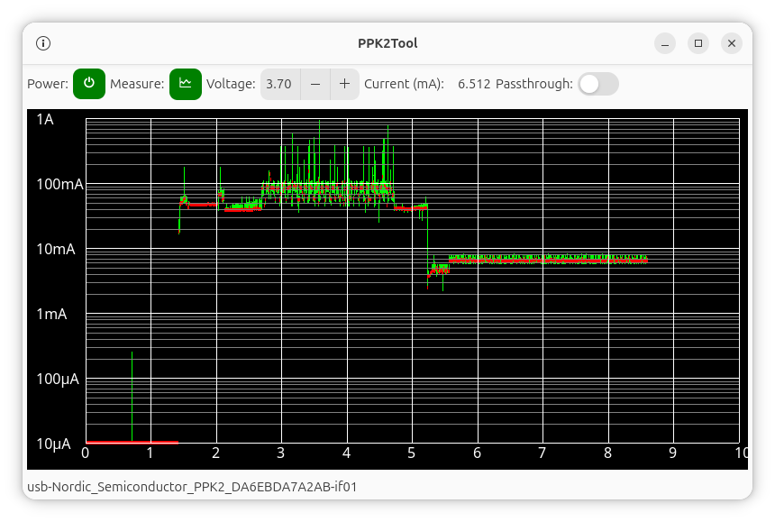

# GUI to operate Nordic Semiconductor Power Profiler Kit 2

This is a GTK4 based UI to visualize measurements coming from
Nordic Semiconductor's
[Power Profiler Kit 2](https://www.nordicsemi.com/Products/Development-hardware/Power-Profiler-Kit-2)

The program `ppk2tool-gtk` is the GUI part only, and relies on a separate
Python module, `ppk2tool`, for communication with the device.

In its present form, the tool relies on Linux specific way to get notified
about connection and disconnection of USB devices, and Linux specific way
of discovering the desired type of device. Contributions of code that would
make it usable on other platforms are welcome (but no AI produced, please!).

Home repo:
[https://git.average.org/cgit/ppk2tool-gtk.git/](https://git.average.org/cgit/ppk2tool-gtk.git/)
or
[github mirror](https://github.com/crosser/ppk2tool-gtk)

Uses low level library:
[https://git.average.org/cgit/ppk2tool.git/](https://git.average.org/cgit/ppk2tool.git/)
or
[github mirror](https://github.com/crosser/ppk2tool)

`.deb` package is available as a github
[release](https://github.com/crosser/ppk2tool-gtk/releases/latest),
but bear in mind that you'd need to download and install the `.deb`
for the low level library as a dependency, e.g. from
[here](https://github.com/crosser/ppk2tool/releases/latest)

## Author

Eugene Crosser \<crosser at average dot org\>
